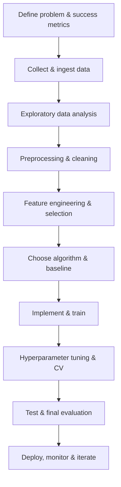

# LightGBM

> Comprehensive, end-to-end reference for LightGBM. Sections follow the "Flow for Learning an ML Algorithm" format:
> Flow, Overview, Math, Loss, Optimization, Hyperparameters, Assumptions, Pros/Cons, Pseudocode, From-scratch implementation, Library examples, Tuning, Metrics, Bias-Variance, Overfitting, Comparisons, Use cases, Projects, Scalability, Interview Qs.

---


## Flow for Learning an ML Algorithm

Mermaid flow:


Notes:
- Start with a simple baseline and clear metric aligned to business cost.
- Iterate: feature work often improves performance more than model changes.
- Keep reproducibility: seeds, environment, versions, train/test splits saved.

## Algorithm Overview & Intuition


LightGBM — description, intuition, and when to use it.

Intuition:
- High-level description of how LightGBM maps inputs to outputs.
- Visual intuition suggestions: plots of decision boundaries (classification), fitted curves (regression), cluster centroids (clustering).

Example intuitive scenario:
- Short toy example explaining predictions and edge cases.


## Problem Type & Use Cases


- Primary problem type: Classification


Typical domains and concrete use cases:
- Finance, healthcare, computer vision, NLP, recommender systems depending on algorithm appropriateness.
- For each use case, include required preconditions (label quality, feature types, volume).

## Mathematical Foundation

Notation:
- X: input matrix (n x d), y: target vector, n: number of samples, d: features, θ: parameters.

Core equations:
- Present model hypothesis and probabilistic interpretation where applicable.
- Derivations: include step-by-step derivation for learning rules (closed-form if present).

Geometric/statistical view:
- Discuss projections, margin maximization, density modeling, or neural parameterization depending on algorithm.


## Cost / Loss Function


- Provide the exact loss form used by this algorithm (MSE, cross-entropy, hinge, negative log-likelihood, ELBO for probabilistic models).
- Present regularized variants (L1, L2, ElasticNet) and robust alternatives (Huber, MAE).
- Visualize typical loss surface characteristics and implications for optimization.


## Optimization Technique


- Describe the optimization approach (closed-form, gradient-based, EM, coordinate descent, second-order methods).
- Convergence guarantees, computational complexity, numerical stability tips.
- When to use mini-batch vs full-batch vs stochastic updates.


## Key Hyperparameters


- List hyperparameters, default ranges, and practical tuning advice.
- Prioritization: which hyperparameters to tune first and diagnostic heuristics (e.g., high variance -> increase regularization).


## Assumptions & Limitations


- Explicit assumptions about data distribution, independence, linearity, stationarity.
- Typical failure modes and mitigation (robust preprocessing, transformations, alternative algorithms).


## Advantages & Disadvantages


- Advantages: interpretability, speed, sample efficiency, robustness in certain scenarios.
- Disadvantages: scalability, sensitivity to hyperparameters, inability to model complex interactions (for simpler models), etc.


## Algorithm Workflow / Pseudocode


Pseudocode (generic supervised training loop):

1. Load and clean data.
2. Split into train/validation/test with appropriate strategy (stratified/time-based).
3. Preprocess features (impute, scale, encode).
4. Train model with chosen hyperparameters.
5. Evaluate on validation; tune hyperparameters.
6. Final evaluation on test; save model.

Complexity:
- Annotate time and memory complexity for training and inference.


## Implementation from Scratch (Python + NumPy)


- Provide a minimal, well-commented NumPy implementation for the core algorithmic idea where feasible.
- Unit-test ideas: synthetic data tests, gradient checks, invariants.

Example pattern (fill with algorithm-specific computations as needed):
```python
# Example: minimal pattern (replace with algorithm-specific math)
import numpy as np

def fit_example(X, y, **kwargs):
    # X: (n, d), y: (n,) or (n, k)
    # Implement algorithm-specific core computation here
    raise NotImplementedError

def predict_example(params, X):
    raise NotImplementedError
```


### Library example (scikit-learn / XGBoost)

```python
# filepath: examples/ensemble_example.py
from sklearn.ensemble import RandomForestClassifier
from xgboost import XGBClassifier
from sklearn.model_selection import train_test_split
from sklearn.metrics import classification_report
import numpy as np

# synthetic data
X = np.random.randn(1000, 20)
y = (X[:, 0] + 0.5 * X[:, 1] > 0).astype(int)
X_train, X_test, y_train, y_test = train_test_split(X, y, test_size=0.2, random_state=0)

rf = RandomForestClassifier(n_estimators=100, max_depth=8, random_state=0, n_jobs=-1)
rf.fit(X_train, y_train)
print("RF:", classification_report(y_test, rf.predict(X_test)))

xgb = XGBClassifier(n_estimators=200, learning_rate=0.05, use_label_encoder=False, eval_metric='logloss')
xgb.fit(X_train, y_train)
print("XGB:", classification_report(y_test, xgb.predict(X_test)))
```


## Implementation using ML Libraries


- scikit-learn examples (fit/predict, pipelines, saving/loading).
- For neural models: PyTorch/TensorFlow minimal example (model, loss, optimizer, training loop).
- For ensemble/GBMs: XGBoost / LightGBM / CatBoost example usage and common flags.


## Hyperparameter Tuning Methods


- Grid search, random search, Bayesian optimization (Optuna/Hyperopt), evolutionary strategies.
- CV strategies (k-fold, stratified, time-series split) and nested CV for unbiased selection.
- Early stopping and multi-fidelity methods (Hyperband, ASHA).


## Model Evaluation Metrics


- List metrics by problem type (accuracy, precision, recall, F1, AUC for classification; MSE/RMSE/MAE/R^2 for regression).
- Calibration, confusion matrices, PR curves for imbalanced problems.


## Bias-Variance Tradeoff Analysis


- Explain bias and variance, show typical diagnostic plots (learning curves).
- Remedies for each scenario and concrete examples.


## Handling Overfitting & Underfitting


- Regularization, feature selection, ensembling, data augmentation, early stopping, cross-validation, and adding data.
- Practical monitoring suggestions and model selection heuristics.


## Comparison with Similar Algorithms


- Short prose comparing strengths/weaknesses vs alternatives.
- Decision rules: when to pick this algorithm vs others.


## Real-World Applications / Case Studies


- Provide 2–3 concise case studies: data description, chosen approach, metric, deployment considerations, lessons learned.


## Practical Project / Dataset Experiment


- Suggested datasets and step-by-step project blueprint, reproducibility checklist, and evaluation rubric.


## Performance Optimization & Scalability


- Engineering optimizations (vectorization, batching), approximate algorithms (ANN for KNN), sparse data handling, GPUs/TPUs, distributed training.
- Serving considerations: model size, latency, quantization, distillation.


## Common Interview Questions


- Curated conceptual, derivation, and debugging questions with short answer pointers.
- Provide sample answers or references to canonical materials.


## Visual Flow & Checklists


- Include mermaid diagrams, checklist items for reproducibility and deployment readiness.
- Example mermaid graph:
